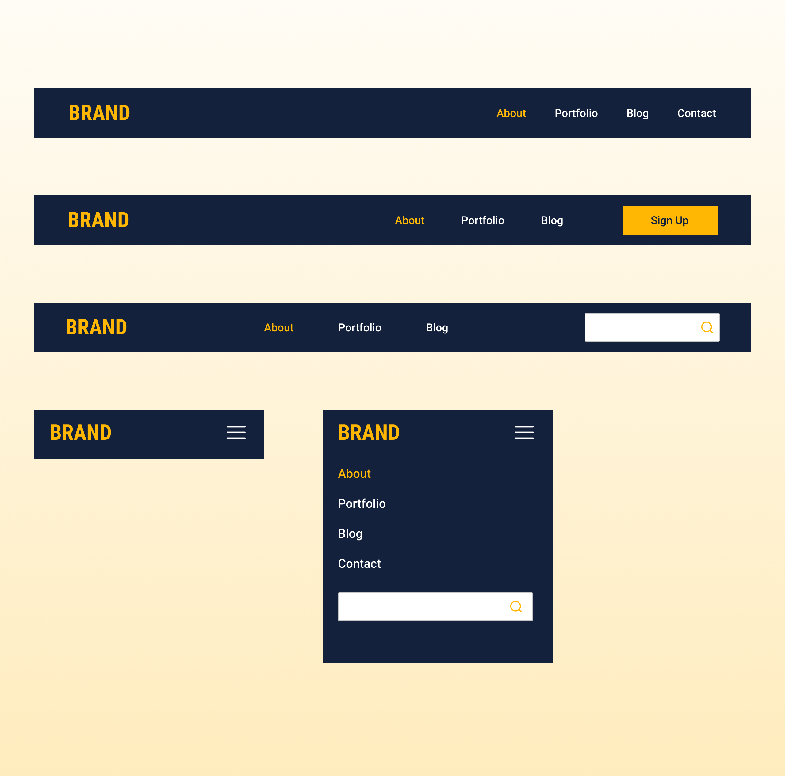

# Responsive Navigation Manu Bar ☰ 

 

### Responsive Navbar menu ☰
- Navigation menu using html, css, and Js
- Using Flexbox for the alignment of things
- Responsive on mobile with transition effect
- Three (3) styled navbar menu

#### Join the channel to see more videos like this: 

